### Tabla de contenido


- [PAGINA INICIO](../README.md/#manual-git-y-github)
- [GIT](#git)
- [Comandos básicos de consola](#comandos-básicos-de-consola)
- [Comandos basicos de git](#comandos-basicos-de-git)
  - [Configuración inicial de GIT](#configuración-inicial-de-git)
    - [Configuración base de GIT, usuario y correo (git config) (git init)](#configuración-base-de-git-usuario-y-correo-git-config-git-init)
  - [Ramas en git](#ramas-en-git)
      - [git branch](#git-branch)
      - [git status](#git-status)
      - [git add](#git-add)
      - [git commit](#git-commit)
      - [Git log](#git-log)
      - [Git chekout y reset](#git-chekout-y-reset)
      - [alias](#alias)
      - [gitignore](#gitignore)
      - [git diff](#git-diff)
  - [Desplazamiento entre versiónes](#desplazamiento-entre-versiónes)
    - [Git reset, reset --hard y reflog](#git-reset-reset---hard-y-reflog)
      - [git reset](#git-reset)
      - [git reset --hard](#git-reset---hard)
      - [git reflog](#git-reflog)
      - [revert](#revert)
  - [Git tag](#git-tag)
- [Branch y switch](#branch-y-switch)
    - [git branch](#git-branch-1)
    - [git switch](#git-switch)
- [Git merge](#git-merge)
- [Conflictos en Git](#conflictos-en-git)
- [Git stash](#git-stash)
- [Reintegración en Git](#reintegración-en-git)
- [Eliminación de ramas](#eliminación-de-ramas)
- [Git y Git-Hub](#git-y-git-hub)
- [Autenticación SSH](#autenticación-ssh)
  - [Donde buscar el SSH](#donde-buscar-el-ssh)
  - [Crear SSH](#crear-ssh)
  - [Sincronizar Git con GitHub](#sincronizar-git-con-github)
- [Repositorio y proyecto](#repositorio-y-proyecto)
  - [Git remote](#git-remote)
  - [git push](#git-push)
- [Subida de proyecto](#subida-de-proyecto)
  - [Git fetch](#git-fetch)
  - [Git pull](#git-pull)
  - [git push, pull y errores](#git-push-pull-y-errores)
- [Git clone](#git-clone)
- [Git fork](#git-fork)
- [Flujo colaborativo](#flujo-colaborativo)
  - [Pull request](#pull-request)
- [Herramientas graficas para GitHub](#herramientas-graficas-para-github)
- [Git git-flow](#git-git-flow)
- [git-hub pages - actions](#git-hub-pages---actions)
 
.


# GIT

Sistema de control de versiónes distribuido

# Comandos básicos de consola

* Listar
> ls

* Mover entre carpetas 
>cd
>
>cd ruta donde quiero ir, \ para los espacios

* Crear carpetas 
>mkdir
>
>mkdir "nombre de la carpeta"

* Crear archivos

>touch 

>touch nombre.extension

* Eliminar archivos

> rm 

Con **rm nombre-del-archivo** se borran, si se requiere borrar varios archivos se pueden colocar simultaneamente separados por un espacio

>rm archivo1  
>rm archivo1 archivo2 archivo3 etc

* Eliminar carpetas

> rmdir rm

Para eliminar carpetas vacias se usa el comando **mrdir**

Cuando la carpeta no se encuentar vacia se puede usar solo **rm**, pero es necesario añadir otros argumentos o flags como -r y -f

Con -r elimina la carpeta y todo su contenido de forma recursiva

Con -f fuerza la eliminación sin pedir confirmación

> rm -rf nombre-de-la-carpeta

- [Tabla de contenido](#tabla-de-contenido)

# Comandos basicos de git

Revisar la version de git
>git version

Ayuda en git
> git --h  
> git --help

## Configuración inicial de GIT

### Configuración base de GIT, usuario y correo (git config) (git init)

>git config --global user.name "Nombre que quiero indicar"

>git config --global user.email "Email que quiero indicar"

En la carpeta donde tengo la información que subire a git, escribo git init para inicializar.

Al inicializar, en la consola nos inidca la palabra (master)
>git init

Este comando **git init** nos crea una carpeta oculta llamada .git , la cual se encarga de guardar todas las versiones que creemos posteriormente.

- [Tabla de contenido](#tabla-de-contenido)
  
## Ramas en git

#### git branch
Al inicializar se crea la rama master, que es la rama principal, tambien se le puede cambiar el nombre a main con el comando git branch -m main, y visceversa

>git branch -m main  
>git branch -m master

#### git status
Para validar el estado en el que estamos, si todo se encuentra subido o si tenemos documentos nuevos modificados se usa el comando git status

>git status

Este nos muestra en rojo los archivos que no se encuentran añadidos a git, ya sea porque son nuevos o porque han sido editados, y en verde los que ya se encuentran añadidos

#### git add

git add nos añade el archivo. Se puede indicar el nombre exacto del fichero a trabajar por ejemplo **git add ensayo.py** o se puede indicar . al final para añadir todos los ficheros a la vez **git add .**

>git add nombre-del-fichero

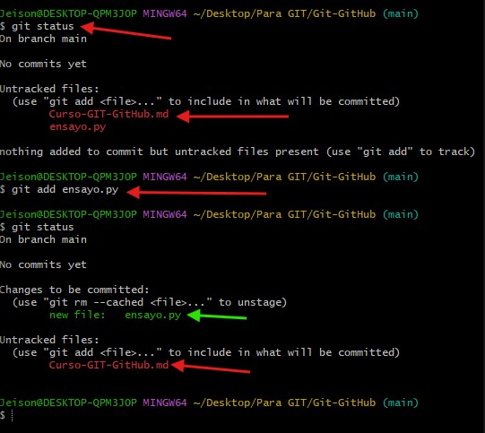

#### git commit

Para crear una copia, una version del proyecto se usa el comando **git commit**, al enviar un commit, se abre inmediatamente un editor para guardar un comentario sobre este commit. To lo que se encuentra con # al inicio son comentarios.

> git commit

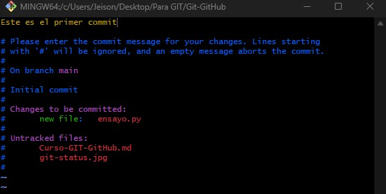

Para evitar que salga un nuevo editor cada vez, se añade -m y en " " se ingresa la nota correspondiente

> git commit -m "Este es mi primer commit"

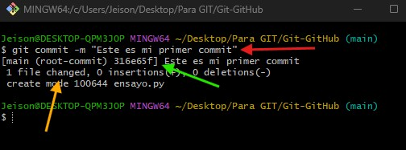

Al enviarlo por consola nos muestra también el hash correspondiente al cambio, y nos indica la funcion que se realizó

#### Git log

Con **git log** se muestran las versiones que tiene el documento, indicando el usuario que realizo el commit, el correo del usuario, la fecha y la hora.

>git log

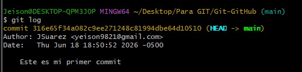

Con --graph nos muestra la información en un orden

> git log --graph

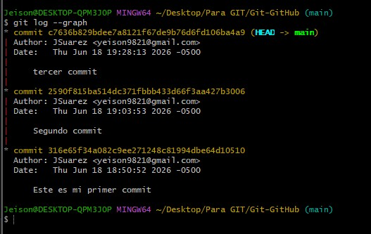

añadiendo --pretty=oneline se puede reducir la información y solo tener el hash y la nota

> git log --graph --pretty=oneline

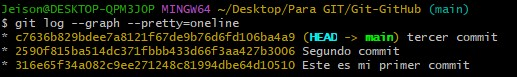

con **--decorate --all** se puede reducir un poco más

 >git log --graph --decorate --all --oneline

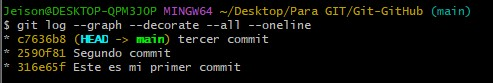


#### Git chekout y reset

Cuando he modificado archivos pero quiero volver cambiar esas modificaciónes puedo con **git checkoup** visualizar una version antigua 


> git checkout

Si quiero volver a algun punto anterior debo usar **git reset**

> git reset

***Ejemplo***

Tienes un dibujo de un carro.

* Commit 1  
Carro azul  
* Commit 2  
Carro verde  
* Commit 3  
Carro rojo  

Si haces:

**git checkout Commit2**

Ves el carro verde.

**Pero todavía existen:**

Azul
Verde
Rojo

Si haces:

**git reset --hard Commit2**

Git vuelve el proyecto al carro verde.

Azul  
Verde ← actual  
Rojo (ya no está en la rama)  

Mas información sober **git reset** [Git reset hard y reflog](#git-reset-hard-y-reflog)

#### alias

En git para minimizar la escritura de comandos dentro de la configuración se puede asignar una variable para llamar dicho comando, a esta variable se le llama **alias**

>git config --global alias."nombre-de-la-variable-que-voya-a-usar "comando de git que va a ejecutar cuando sea llamada."

 **NO AÑADIR GIT EN EL COMANDO A MAPEAR**"

>git config --global alias.tree "log --graph --decorate --all --oneline"

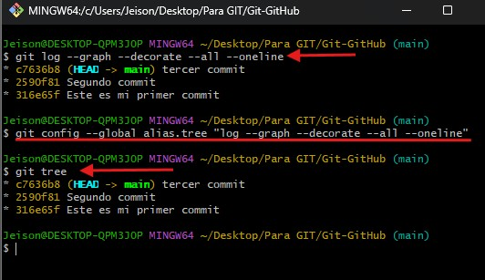

Al crear el alias, se muesta el mismo resultado con el comando completo, y con el comando con el alias

En el fichero **.gitconfig** se pueden ver los alias creados

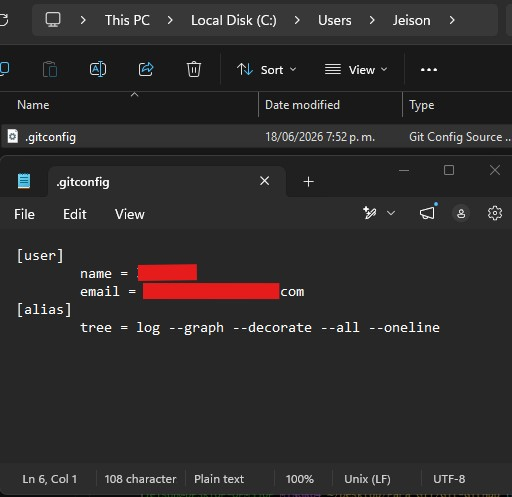

#### gitignore

Si tengo ficheros, rutas, expresiones que no quiero que queden en ninguna de las versiones, pero tampoco quiero que git status me los muestre cada vez, puedo crear el fichero .gitignore en la carpeta raiz

Dentro de .gitignore se sigue la nomenclatura **\.

>**\.archivo que no queremos

Y todo lo que tengamos ahí no saldra más cuando enviemos un git status

#### git diff

Nos muestra los cambios que hemos realizado sin necesidad de volver al ultimo commit.

>git diff

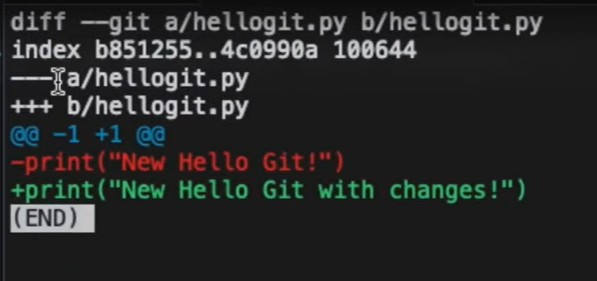

- [Tabla de contenido](#tabla-de-contenido)
  
## Desplazamiento entre versiónes

Cuando usamos un log para mirar el historial de versiones, vemos que una de ellas dice ***(HEAD -> main)***, esa es la version en la que nos encontramos y estamos trabajando en este momento.

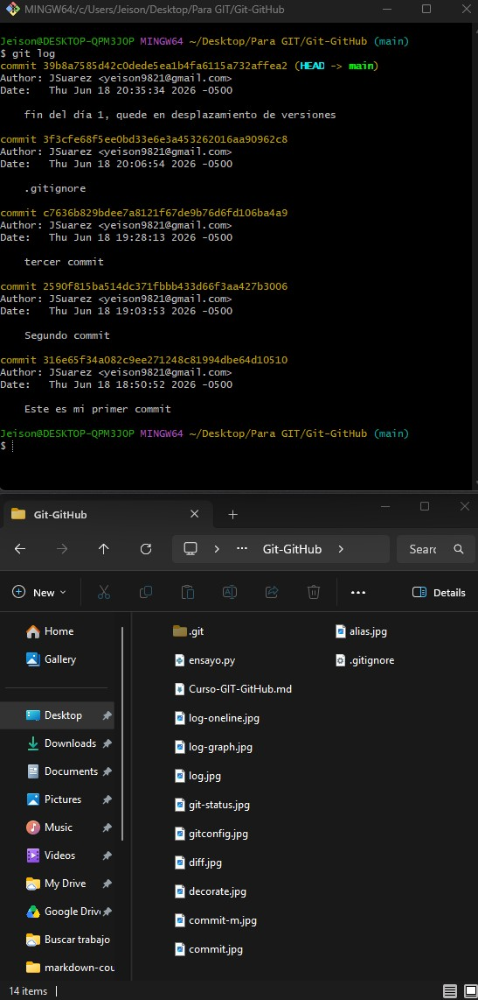

Para volvel a una versión-foto anterior, es necesario tomar el hash de la version a la que queremos ir.

Con **git checkout y el hash de la versión a la cual quederemos ir, podemos pararnos sobre dicha versión. Sin embargo, si tenemos cambios realizados sin guardar que se puedan perder nos indicará un error y abortará el comando

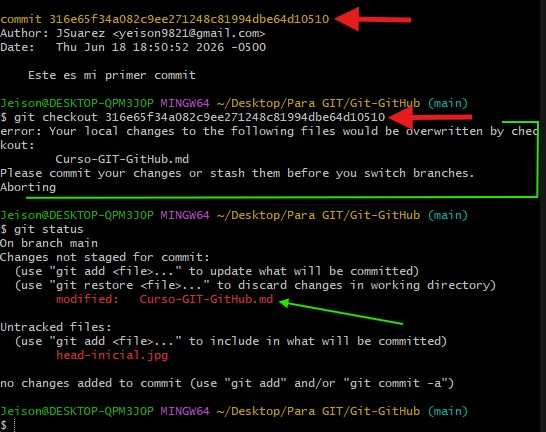

Luego de guardar con add y commit, o descartar los cambios haciendo un git checkout a el ultimo archivo que no se ha guardado para eliminar los cambios; en ese momento si se puede enviar el comando **git chekout hash-de-la-version-a-revisar**.

En ese momento nos indica que ahora el HEAD se encuentra en otra versión-foto, y en la carpeta donde tenemos los archivos, se evidencia que solo se encuentra lo que se guardo en ese momento, y se borro lo demás.

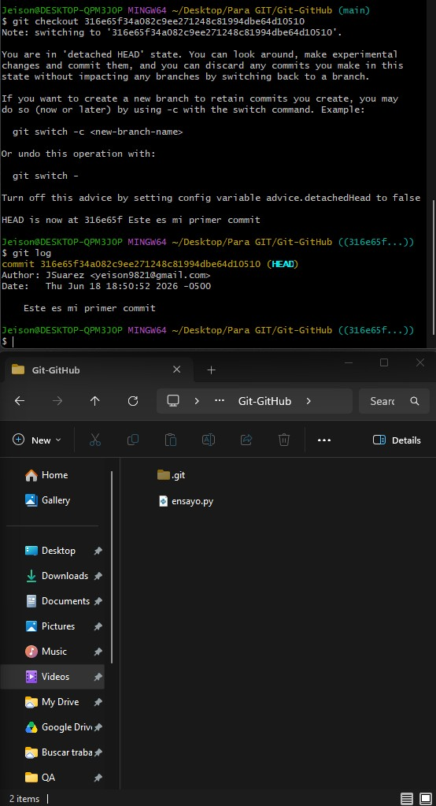

Al revisar las versiónes, se ve que el (HEAD) ahora se encuentra en el primer commit que hicimos, llamado "Este es mi primer commit"

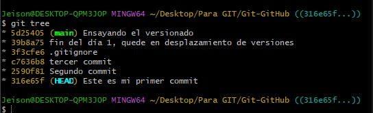

Haciendo nuevamente **git checkout hash-el-ultimo-commit** y ya vuelve la información completa que teniamos.

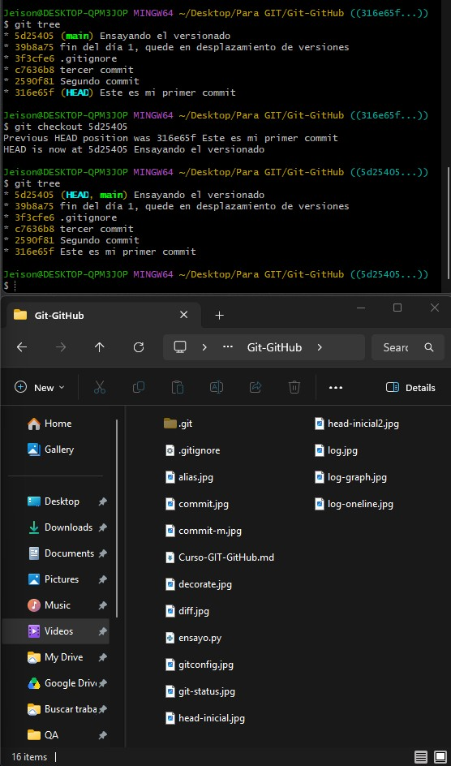

Todas esas versiones ydocumentos se encuentran guardados en la carpeta .git, y está se encarga de guardar o borrar los ficheros dependiendo de el commit donde se encuentre el (HEAD) actualmente.

### Git reset, reset --hard y reflog

#### git reset

Recordar que el **git reset** es un comando para descartar cambio de lo que se ha hecho ultimamente y volver a un punto en especifico.

En este ejemplo hay 4 commits y nos encontramos en el cd71041

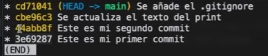

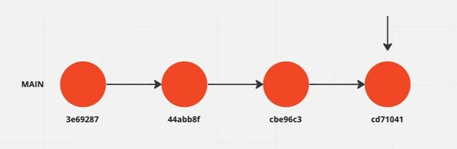

#### git reset --hard

Pero si por alguna razón yo no quiero tener más algún commit, para el ejemplo no quiero tener el cbe96c3 ni el cd71041, puedo usar **git reset --hard hash-del-commit-al-que-quiero-volver** y se borrará el resto de commits de ahí en adelante

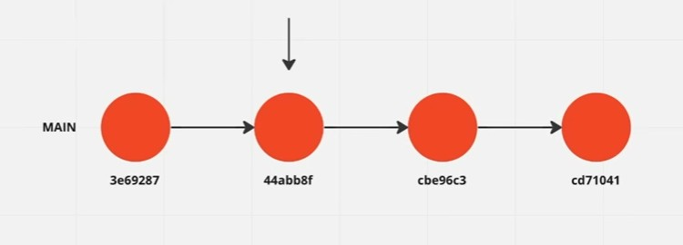

> git reset --hard 44abb8f

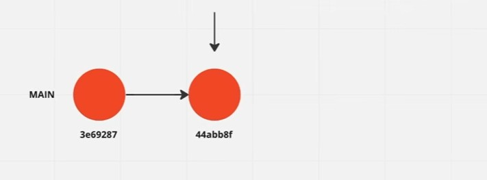

#### git reflog

Con el comando **git reflog** se puede ver el historiar completto de interacciones que se han hecho en git, y se pueden ver nuevamente los commits que fueron borrados anteriormente con git reset --hard

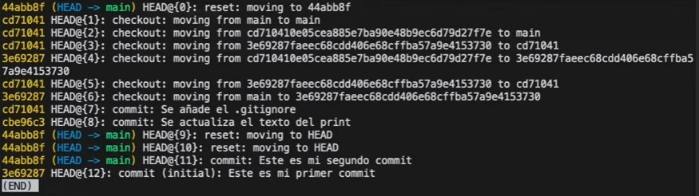

Si con esta información yo me muevo a el ultimo commit cd71041 con checkout, aparecerán de nuevo los otros commits, y se indicará que el commit que escogi es el nuevo HEAD, pero la rama principal main sigue siendo el commit donde se hizo el reset --hard

 en el ultimo commit ")

Para tener el HEAD y el main en un mismo lado, recuperando todo lo que habiamos borrado, se puede hacer el git reset --hard hash-del-commit-final


---
---
---
---
#### revert

```
Al parecer borra definitivamente todo un commit, investigar más
```
---
---
---
---

- [Tabla de contenido](#tabla-de-contenido)

## Git tag

Los tags son etiquetas o referencias que se hacen a los commits, suelen hacerse en commits importantes, por ejemplo, indicar que esta es una versión completa de una app.

Como buena practica, deberian ser todos en minusculas y con _

> git tag nombre_del_tag

Para revisar los tags creados se usa solo el comando **git tag**

> git tag

También podemos usar esos tags para movernos entre versiones

> git checkout tags/nombre_del_tag

- [Tabla de contenido](#tabla-de-contenido)
  
# Branch y switch

Hasta el momento todo ha sido trabajado en la rama/branch principal main.

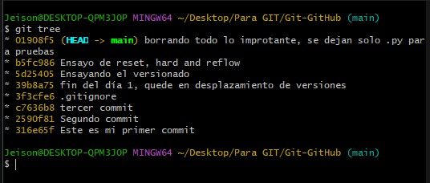

Supongamos hasta el momento lo que hemos hecho es para una app, y ahora necesito desarrollar una funcionalidad puntual como un login, pero no quiero interrumpir el desarrollo de la rama principal.

### git branch

Con el comando **git branch nombre_de_la_nueva_rama, se creará la rama alterna por la cual yo podré trabajar.

> git branch nombre_de_la_nueva_rama

> git branch login

Se creo el branch login, pero aun me encuentro sobre la rama main.

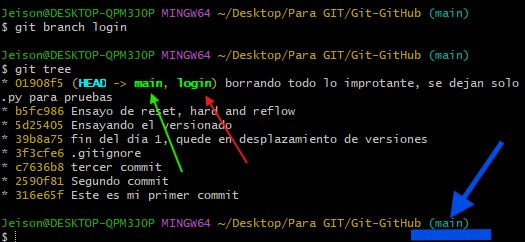

### git switch

Con el comando **switch** pasamos de una rama a la otra. Al final del encabezado de la ruta cambia el nombre del branch, y al revisar en un log se indica que el (HEAD) se encuentra en la nueva ubicación.

> git switch nombre_de_la_rama

> git switch login

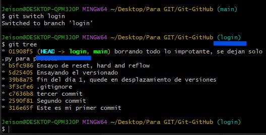

Lo que hagamos en la rama login creará una nueva linea y los ficheros que se creen en esa rama se quedarán unicamente en esa rama.

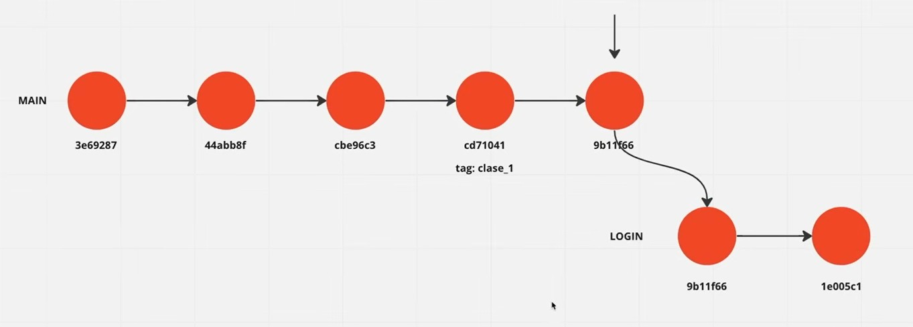

En la rama login se ha creado el documento login.py

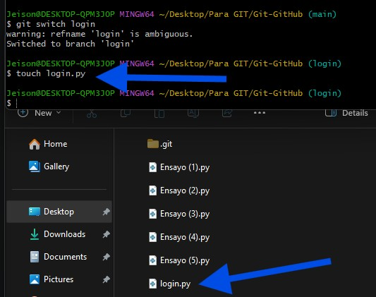

Pero al pasar a la rama main, se evidencia que el archivo login.py no se visualiza, ya que solo fue creado dentro de la rama login

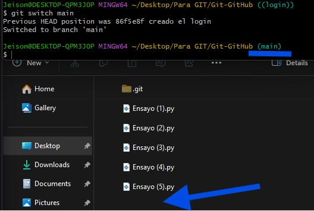

- [Tabla de contenido](#tabla-de-contenido)

# Git merge

Cuando hay varias ramas se usa el comando **git merge nombre_de_la_rama** para unificar los archivos de ambas ramas y conocer el progreso que se haya tenido en simultanea.

Para este ejemplo en la rama main se han modificado internamente los archivos .py, y luego en otro commit se han borrado los archivos Ensayo (4).py y Ensayo (5).py

Y en la rama login se ha creado un nuevo archivo llamado "login-2.py"

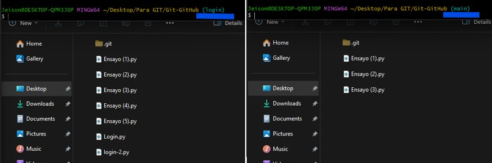

Estando en el branch login, se ejecuto el comando git merge main para unir la rama en la que estoy actualmente, con la rama que necesito.

Al unirse se evidencia que tanto los cambios creados en la rama login como los cambios creados en la rama main se unieron, quedando juntas las carpetas sobrantes de main y los nuevos archivos de login

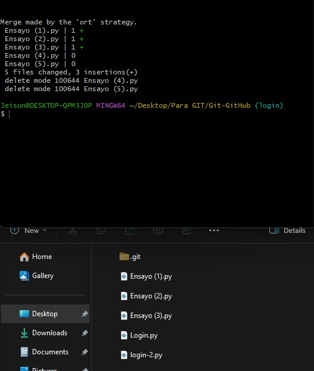

Al revisar en un log, se puede ver como se separaron las ramas y ahora se unieron de nuevo

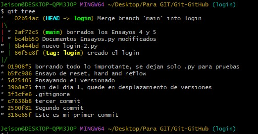

representación más visual
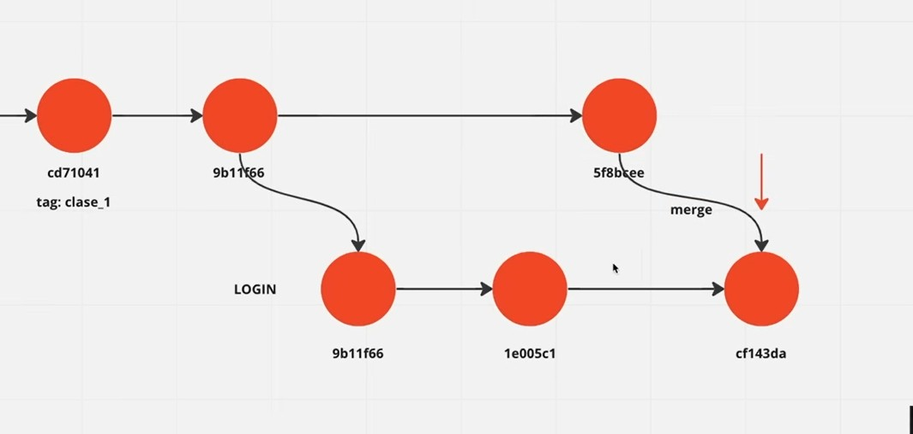

- [Tabla de contenido](#tabla-de-contenido)
# Conflictos en Git

Al trabajar en 2 ramas cada equipo deberia tener claridad sobre que archivos puede o no modificar, sin embargo, si en un archivo compartido por 2 lineas, al mismo tiempo hay modificaciones iguales en las mismas lineas git detecta que hay valores distintos en el mismo lado y no permite hacer el merge hasta que se solucione dicho error.

Para el ejemplo, tanto desde main como desde login se modifico la primera linea del archivo Ensayo (1).py con información distinta.

Al enviar el merge nos indica que hay un conflicto en Ensayo (1).py

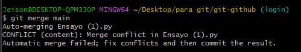

Y en VSC nos indica el archivo y las lineas que están generando el conflicto.

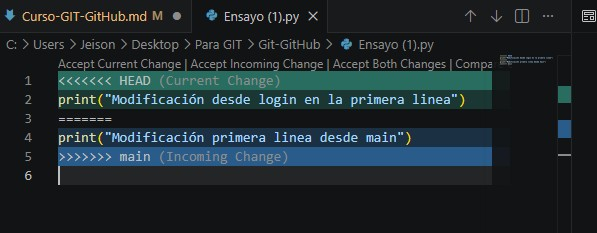

Luego de arreglar el conflicto y descidir cual de las 2 lineas de codigo es la que va a quedar realmente en el fichero se commitea nuevamente y ya permite hacer el switch.

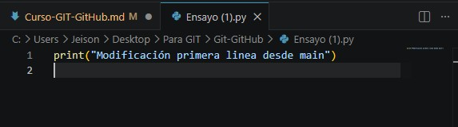
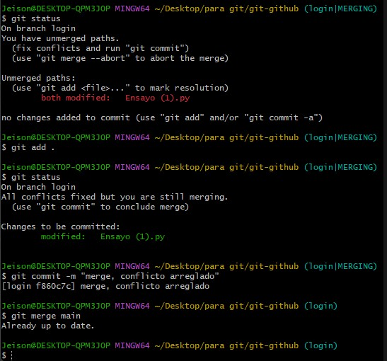

- [Tabla de contenido](#tabla-de-contenido)
# Git stash

Sirve para realizar una copia local del proceso que llevemos sin afectar la rama completa o tener que hacer un commit.

Ayuda cuando necesitamos dejar la actividad que estamos haciendo, guardar momentaneamente para cambiar de rama, guardar progresos de los cuales no estamos seguros si vale la pena hacer un commit, etc.

Se guarda en el sistema local, por lo cual se puede apagar el equipo y no hay problema.

Para crear el stash se usa el comando **git stash**

> git stash

Para revisar los stash que tengo se uas **git stash list**

Al revisar la lista, los stash quedan marcados como stash@{#} estando en 0 el más reciente e incrementando el número cuando es más antiguo.

> git stash list

Usualmente cuando vuelve a la rama nuevamente luego de cambiar de rama queda en el ultimo commit, por lo cual se debe traer el stash con el comando **git stah pop** o **git stash apply**

Si solo hay un stash no es necesario especificar, pero si hay varios, luego del **git stash pop se_indica_el_stash_a_retornar** por ejemplo **git stash stash@{1}**

> git stash pop
> 
> git stash apply

Si se quiere borrar ese stash perdiendo todos los cambios ya que no son requeridos se usa **git stash drop** o **git stash clear** 

> git stash drop
> 
> git stash clear

**Nota:** recordar que si luego de ejecutar el stash no queremos esos cambios, se puede volver al ultimo commit con **git reset --hard** .

- [Tabla de contenido](#tabla-de-contenido)
# Reintegración en Git

Los cambios de desarrollo y pruebas usualmente se hacen en las ramas correspondientes, en este caso, el apartado de login se implemento en la rama de login.

Cuando ya esté bien, se debe implementar en la rama principal, en este caso main.

Con **dit diff** se pueden mirar las diferencias que hay entre las 2 ramas antes de hacer un merge, si todo sale bien, se puede hacer el merge, add, commit.

* Esquema de ejemplo
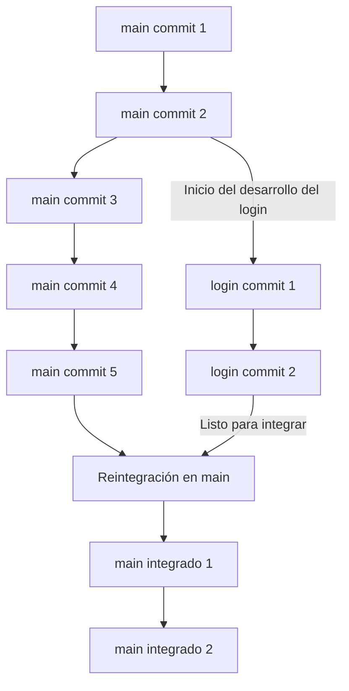
```mermaid
graph TD
  A[main commit 1] --> B[main commit 2] --> C[main commit 3] --> E[main commit 4]
  B[main commit 2] --> |Inicio del desarrollo del login| D[login commit 1] --> F[login commit 2]
  E[main commit 4] --> G[main commit 5] --> H[main commit 6]
  F[login commit 2] -->|Listo para integrar| H[Reintegración en main] --> I[main integrado 1] --> J[main integrado 2]

```

- [Tabla de contenido](#tabla-de-contenido)
# Eliminación de ramas

Cuando una rama cumple su funcion, lo ideal es que sea eliminada para evitar información innecesaria.

Para borrarlas se usa el comando **git branch -d nombre_de_la_rama**

> git branch -d nombre_de_la_rama
>
> git branch -d login

Luego de hacer el git branch -d login ya no aparece más la ráma login

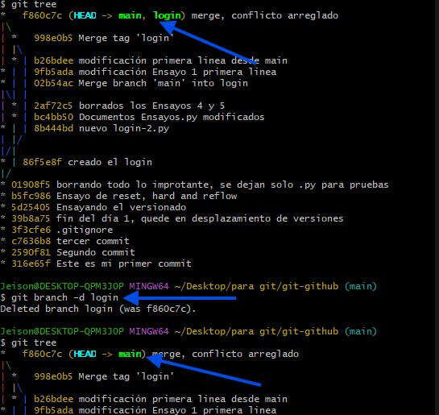

Al tratar de cambiar a la rama login, no se encuentran coincidencias

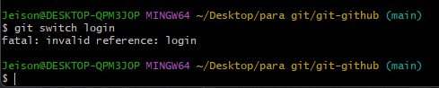

- [Tabla de contenido](#tabla-de-contenido)
# Git y Git-Hub

# Autenticación SSH

## Donde buscar el SSH

En el perfil de cada usuario se crea una carpeta oculta llamada .ssh , en esa carpeta se encuentra el SSH y las claves SSH que se hayan usado.

En windows está en "C:\Users\Mi_usuario\\.ssh

Los nombres comunes son:
* id_rsa.pub
* id_ecdsa.pub
* id_ed25519.pub

O desde la consola se puede ingresar el comando "ls ~/.ssh"

> ls ~/.ssh

## Crear SSH

1. Si no tengo un SSH creado, desde consola ingreso los siguientes comandos.

> ssh-keygen -t ed25519 -C "tu_correo_github"

2. Luego sale un mensaje que dice "Enter file in which to save the key" a lo cual se le va a dar clic a la tecla "Enter"

3. Luego preguntará por una passphrase (Contraseña para proteger la clave) con lo cual tienes 2 opciones.
   * Escribir una contraseña (más seguro).
   * Presionar Enter dos veces para continuar sin crear passphrase. (más cómodo para aprender y usar Git diariamente).

4. Revisar la carpeta o escribir el codigo "ls ~/.ssh" para confirmar que ya contamos con la clave SSH privada, y la publica .pub

**SOLO SE DEBE USAR LA CLAVE .PUB, YA QUE ES LA CLAVE PUBLICA. EL OTRO ARCHIVO CONTIENE LA CLAVE PRIVADA.**

## Sincronizar Git con GitHub

1. Si ya creamos o teniamos una clave SSH, desde Git Bash ejecutar cat ~/.ssh/id_ed25519.pub para ver la clave ssh publica

> cat ~/.ssh/id_ed25519.pub

O revisar el documento desde la carpeta .ssh

Copiar la linea completa 

ssh-ed25519 AAAAC3NzaC1lZEAAA... correo

2. Abrir GitHub en el navegador (Ya se debe contar con una cuenta previa), e ir a la ruta Settings -> SSH and GPT keys -> New SSH key

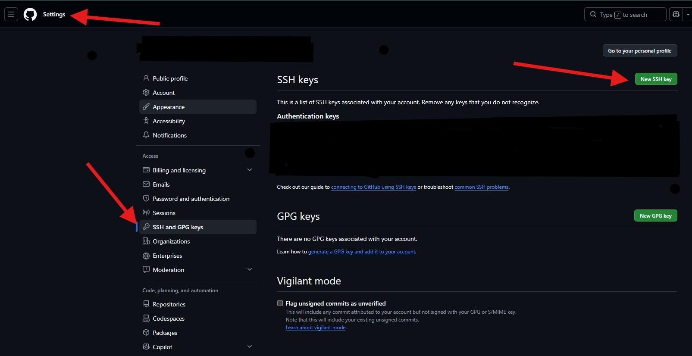

En ese apartado colocar un titulo para identificar la conexión.

Seleccionar Autentication Key.

Ingresar la clave SSH

Oprimir Add SSH key

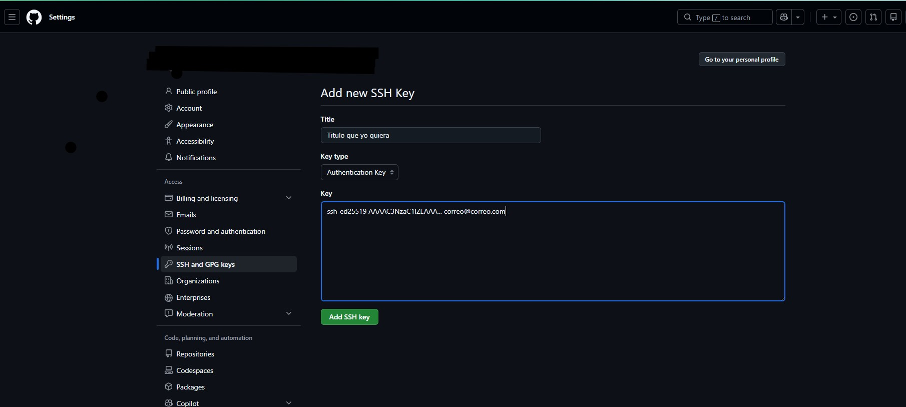

3. En la consola de nuestro PC ingresar $ ssh -T git@github.com para crear la primera sincronización y garantizar que la conexión es correcta.

> $ ssh -T git@github.com

Saldra un mensaje 

>>This key is not known by any other names.
Are you sure you want to continue connecting (yes/no/[fingerprint])? 

Para añadirla a las claves reconocidas de conexión SSH de nuestro equipo, se escribe yes y se da enter.

Luego del enter debe salir un mensaje similar indicando que el proceso fue correcto.

>>Warning: Permanently added 'github.com' (ED25519) to the list of known hosts.
Hi nombre_usuario_github You've successfully authenticated, but GitHub does not provide shell access.

- [Tabla de contenido](#tabla-de-contenido)
# Repositorio y proyecto

***Inicial e importante***

Revisar con que la información de usuario y correo sean correctas. 

**git config --global user.name "Nombre de usuario"**

***git config --global user.email "tu_correo@example.com"***

Validar conexión con ssh -T git@github.com

> ssh -T git@github.com

Hi tu_usuario! You've successfully authenticated...

## Git remote

Para sincronizar la carpeta con GitHub se debe:

1. Estar en la carpeta de desarollo, la que tiene el .git
2. Inicializar git
> git init
3. Validar que no hayan archivos pendientes.
> git status
   * En caso de tener archivos pendientes agregarlos con **git add .** o **git add nombre_archivo** y hacer commit con **git -commit -m "comentario del commit** 
4. Crear el repositorio en GitHub
5. Conectar repositorio local con GitHub con el comando dado por github
> git remote add origin git@github.com:usuario/nombre_del_repositorio.git
6. Verificar la conexión con el comando
> git remote -v
7. Subir el proyecto. Tener en cuenta que es necesario conocer el nombre de la rama, por buenas practicas es *main* pero puede ser *master* también. Ingresar el comando **git push -u origin nombre_de_la_rama_principal**

Con el comando **git push** se sube la información a GitHub, al ser la primera vez debemos usar el comando **git push -u origin main**

> git push -u origin main 

## git push

Cuando queremos subir los cambios de git a github se envia el comando **git push**

> git push

Tener en cuenta que la primera vez que se va a sincronizar git con github se debe indicar también a donde se esta sincronizando, y en ese caso se añade -u origin main 

> git push -u origin main

Más información en   - [git push y errores](#git-push-y-errores) 

- [Tabla de contenido](#tabla-de-contenido)
# Subida de proyecto

Desde la misma plataforma de GitHub se puede crear el documento README.md y enviar el commit correspondiente para que se guarde.

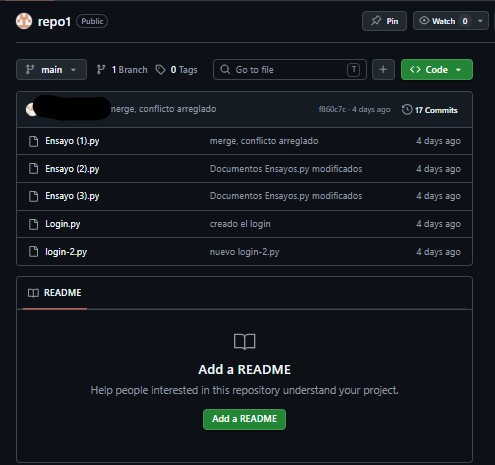

## Git fetch

Con **git fetch** git trae desde GitHub los cambios que se hayan realizado en GitHub archivos modificados por mi o por otros desarrolladores. Y trae esos cambios conservando lo que yo he hecho localmente.

No realiza una sincronización como tal en la carpeta local, pero si compara conflictos.

Por ejemplo, en este caso, al enviar un **git fetch** y luego enviar un **git log --oneline --all --graph se muestra que se creo el documento README.md

> git fetch

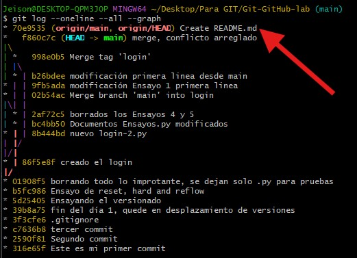

O con un **git status**, aparte de indicarnos las modificaciones que no hemos commiteado, nos indica que hay modificaciones en la rama main.

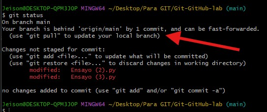

## Git pull

Con **git pull** se sincroniza con GitHub y trae los cambios a nuestra carpeta local siempre y cuando no hayan conflictos.

> git fetch

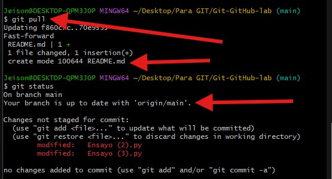

Al enviar el **git pull** nos indica que creo el archivo README.md que se encontraba en GitHub pero no en git.

Y al enviar un **git status** se evidencia que la rama origin/main se encuentra sincronizada.

Sin embargo cabe acralarar que los cambios que hemos hecho no se han subido aun a GitHub
.

## git push, pull y errores

Luego de hacer un **git add .** y un **git commit -m ""** se realiza un **git push**, como en este caso no hay errores, la sincronización es correcta y los documentos en Git y GitHub son los mismos.

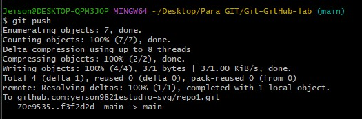

Al modificar la misma linea simultaneamente en el documento Ensayo (3).py y hacer un pull para sincronizar los cambios antes de enviar el push. Nos indica que hay un conflicto que debemos arreglar.

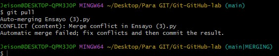

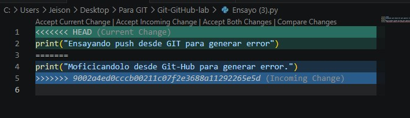

Al arreglar el conflicto en el archivo, guardar y luego comitear, ya se puede realizar el pull y el push normalmente.

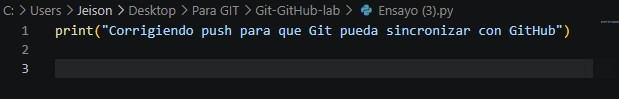

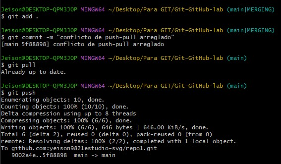

- [Tabla de contenido](#tabla-de-contenido)
# Git clone

Con **git clone** y la url del repositorio (SSH, HTTPS, GitHub CLS dependiendo de nuestra conexión) se puede realizar una copia local del repositorio subido en GitHub.

Este se creará en la carpeta donde nos encontremos.

> git clone "url_repositorio"

- [Tabla de contenido](#tabla-de-contenido)
# Git fork

Sirve para hacer un clon de un repositorio al que no tenga permisos, en mi propio GitHub

En el repositorio de un tercero aparece habilitado el botón fork.

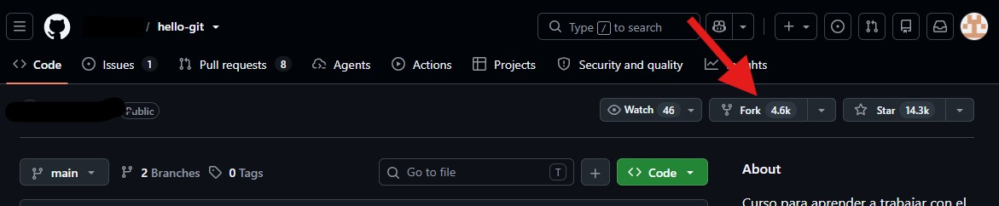

Al ingresar en él, puedo realizar la copia de su repositorio en mi GitHub e indicarle el nombre que yo quiera.

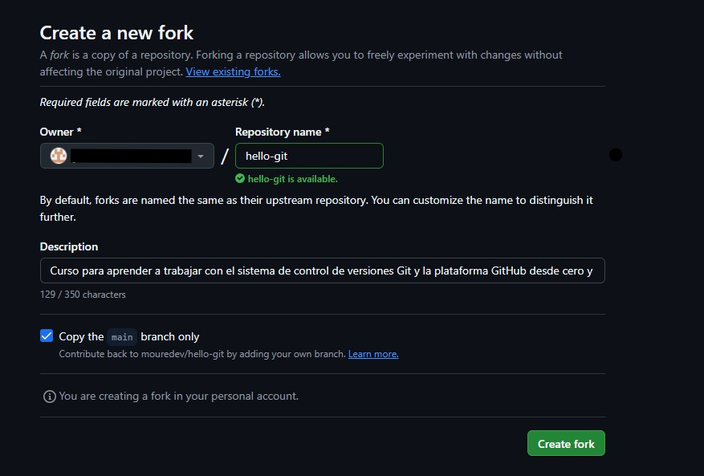

- [Tabla de contenido](#tabla-de-contenido)
# Flujo colaborativo

Al crear un clon de un repositorio con **git fork** se habilita la opción de sincronizar repositorios. Esto con el fin de mantener las ultimas versiones al día en la copia, de las modificaciónes que se hayan hecho en el repositorio original y evitar conflictos.

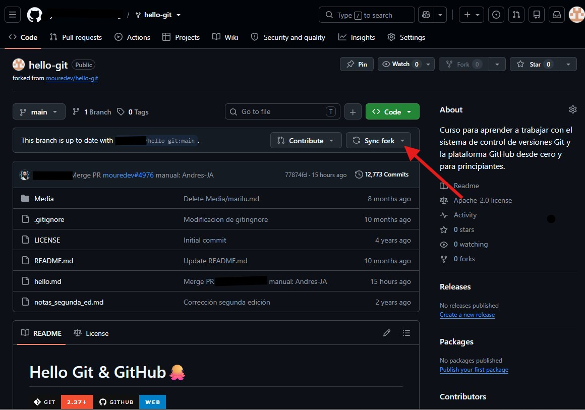

## Pull request

Al realizar cambios en mi copia, puedo sincronizar y enviarle al dueño del documento un **pull request**, el cual le indica al dueño del repositorio los cambios que se hicieron para que él decida si quiere agregar esos cambios a su repositorio o no.

El dueño del repositorio puede aceptar, enviarme un comentario, rechazar, solicitar un cambio.

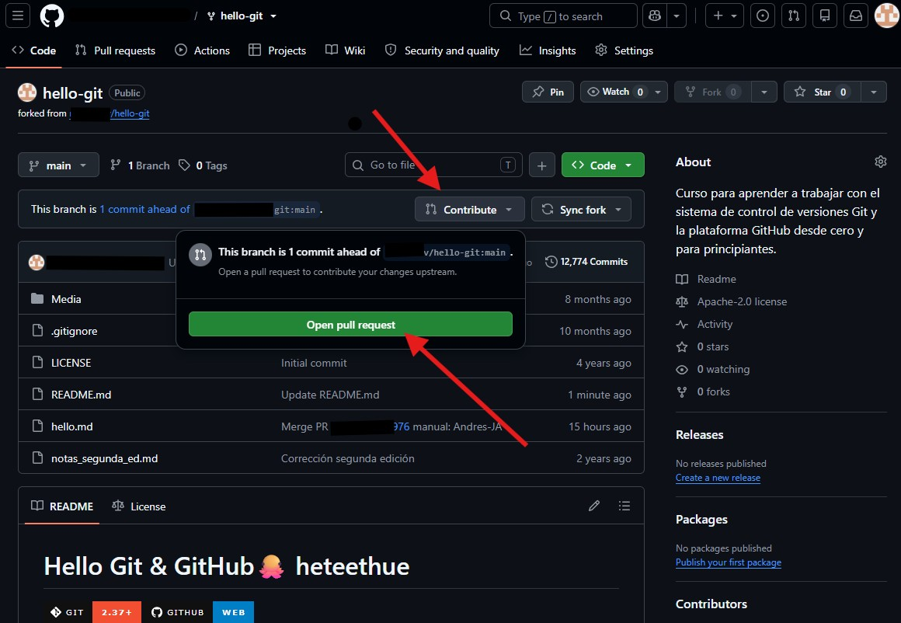


# Herramientas graficas para GitHub

* Git desktop
* Git kraken
* Sourcetreep
* Git fork
  
  - [Tabla de contenido](#tabla-de-contenido)
# Git git-flow

- [Lección 42 - Git y GitHub "flow"](https://youtu.be/3GymExBkKjE?t=15517)

- [Tabla de contenido](#tabla-de-contenido)

# git-hub pages - actions

- [Lección 45 - GitHub Pages y Actions](https://youtu.be/3GymExBkKjE?t=18006)
  
- [Tabla de contenido](#tabla-de-contenido)


